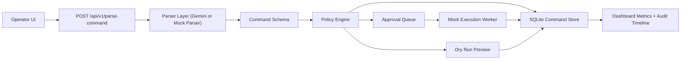

<div align="center">
  
  <h1>AI Command Control Center</h1>
  <p>A guardrailed natural-language operations platform with approvals, audit trails, dry runs, and mock execution.</p>
</div>

## Overview
This project turns natural language instructions into structured backend commands and then walks them through a real operational workflow:

- parsing
- ambiguity handling
- policy evaluation
- approval gating
- queued execution
- audit logging

The goal is to show how AI can be useful in internal operations tooling without giving a model unrestricted control over production systems.

## Real-World Use Case
The most credible real-world framing for this project is:

> A safe AI control layer for internal operations and support tooling.

Examples:

- DevOps teams requesting service health checks or restarts
- IT teams creating or updating internal users
- Support teams triggering safe remediation workflows
- Operators reviewing dry runs before any action is taken

Instead of trusting the model directly, this system converts intent into a typed command, applies backend policy, records every decision, and only then allows execution.

## What Makes It Production-Minded
- Strict Pydantic command schemas
- Default-deny policy enforcement
- Role-aware approvals for sensitive operations
- SQLite-backed command history and audit events
- Dry-run previews for risky workflows
- Mock execution worker with job lifecycle states
- Frontend control center showing metrics, history, detail, and approvals
- Fallback mock parser for deterministic local demos without a live LLM key

## Architecture


## Core Features
### 1. Rich command schema
Each request is normalized into a command model with:

- `op`
- `summary`
- `actions`
- `parameters`
- `target_service`
- `environment`
- `confidence`
- `risk_level`
- `approval_required`
- `needs_clarification`

### 2. Policy engine
The backend uses a role-aware policy engine that can:

- block dangerous or unsupported operations
- deny actions outside the caller's role
- require approval for production-sensitive workflows
- allow safe dry-run previews without execution

### 3. Lifecycle tracking
Commands move through states such as:

- `received`
- `parsed`
- `needs_clarification`
- `blocked`
- `needs_approval`
- `queued`
- `executing`
- `completed`
- `rejected`
- `dry_run_completed`

### 4. Auditability
Every important transition is written to the audit trail so the UI can show:

- who submitted the command
- what the parser returned
- why policy allowed or blocked it
- who approved or rejected it
- what the worker reported back

## API Endpoints
### Core workflow
- `POST /api/v1/parse-command`
- `GET /api/v1/commands`
- `GET /api/v1/commands/{command_id}`
- `GET /api/v1/metrics`
- `POST /api/v1/commands/{command_id}/approve`
- `POST /api/v1/commands/{command_id}/reject`
- `GET /health`

### Required headers
The app uses lightweight demo auth for local development:

- `X-API-Key`
- `X-User-Id`
- `X-User-Name`
- `X-User-Role`

Supported roles:

- `viewer`
- `operator`
- `approver`
- `admin`

## Example Scenarios
### Safe execution
Input:
```json
{
  "instruction": "Check system health and fix any minor issues in staging",
  "environment": "staging",
  "execution_mode": "execute"
}
```

Result:
- parsed as `system.check_and_fix`
- approved immediately
- queued for mock execution
- completed with an execution result

### Approval flow
Input:
```json
{
  "instruction": "Restart the auth service in production",
  "environment": "production",
  "execution_mode": "execute"
}
```

Result:
- parsed as `service.restart`
- marked high risk
- moved to `needs_approval`
- approver can approve or reject it from the dashboard

### Dry run
Input:
```json
{
  "instruction": "Scale the billing service to 4 instances in production",
  "environment": "production",
  "execution_mode": "dry_run"
}
```

Result:
- returns a preview of what would execute
- writes the preview to history
- does not run the worker

### Blocked request
Input:
```json
{
  "instruction": "Drop the production database",
  "environment": "production",
  "execution_mode": "execute"
}
```

Result:
- flagged unsafe
- blocked by policy
- stored in the audit log for review

## Local Development
### Backend
```bash
pip install -r requirements.txt
uvicorn app.main:app --reload --port 8000
```

Create a `.env` from `.env.example` and configure:

```bash
APP_SECRET_KEY=dev-secret-key-123
GEMINI_API_KEY=
PARSER_MODE=mock
COMMAND_DB_PATH=./data/command_center.db
ALLOWED_ORIGINS=http://localhost:5173
REQUEST_RATE_LIMIT=60
RATE_LIMIT_WINDOW_SECONDS=60
EXECUTION_DELAY_SECONDS=0.2
```

`PARSER_MODE=mock` is great for demos because it makes the command parsing deterministic even without an external API key.

### Frontend
```bash
cd frontend
npm install
npm run dev
```

Create `frontend/.env` from `frontend/.env.example` if you want custom values:

```bash
VITE_API_URL=http://localhost:8000
VITE_APP_API_KEY=dev-secret-key-123
```

## Testing And Validation
### Backend tests
The repository includes request-flow tests in [tests/test_main.py](/C:/Users/Harshit%20Mehra/OneDrive/Desktop/college/Automated%20backend/tests/test_main.py).

Run them in a Python environment where the project dependencies are installed:

```bash
pytest
```

### Frontend build
```bash
cd frontend
npm run build
```

The build script uses Vite's native config loader for better compatibility on Windows.

## Deployment
### Docker
You can run the full stack locally with:

```bash
docker compose up --build
```

### CI
The repo includes a GitHub Actions workflow that:

- installs Python dependencies
- runs `pytest`
- installs frontend dependencies
- builds the React app

## Portfolio Positioning
If you are posting this publicly, describe it as:

> An AI-assisted command control center that translates natural language into safe, structured backend actions with approvals, dry runs, and auditability.

That wording lands better than calling it just an NLP parser because it highlights the operational value and the safety architecture.
